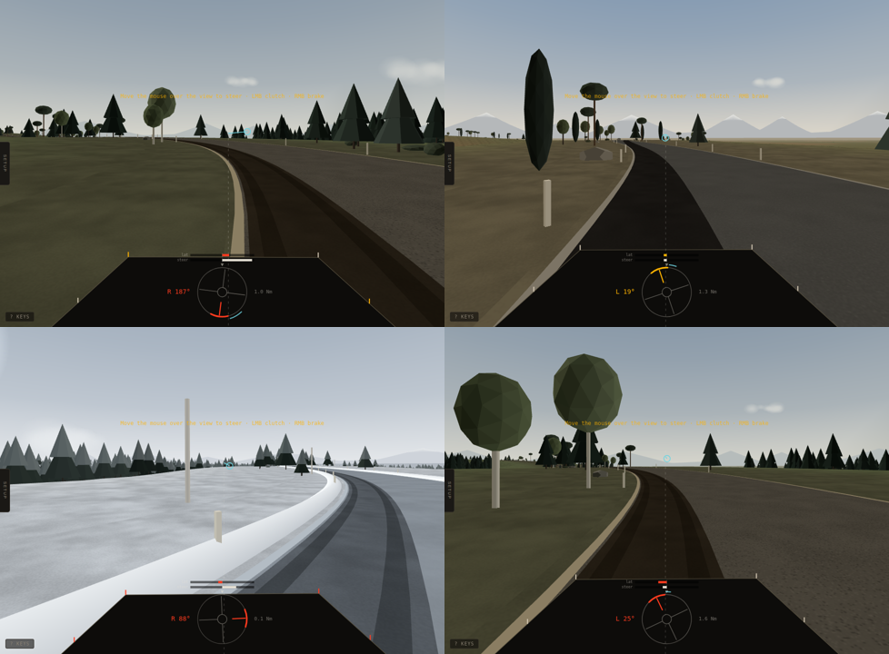
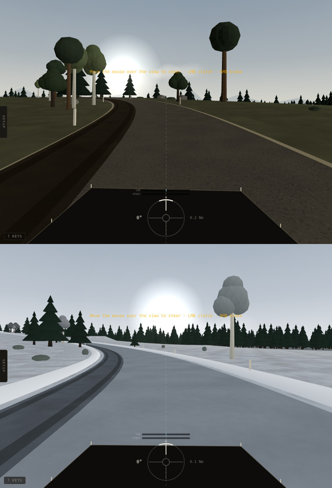
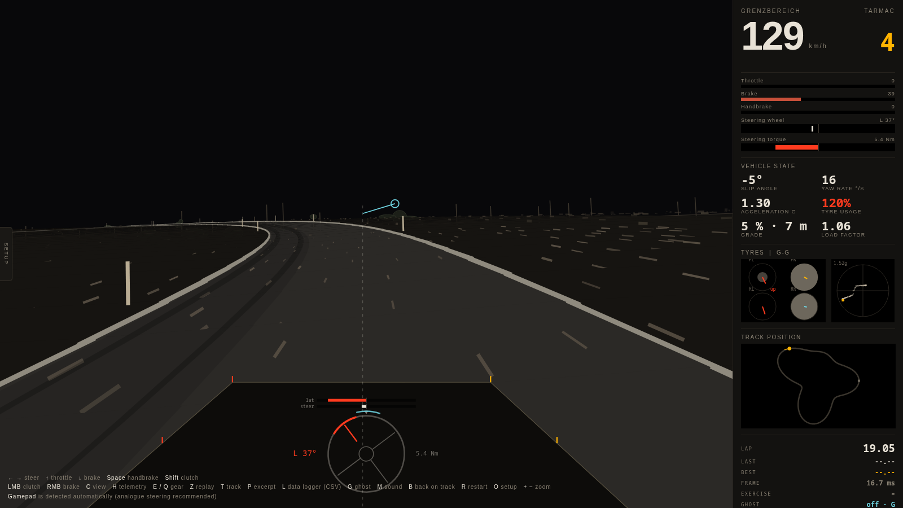
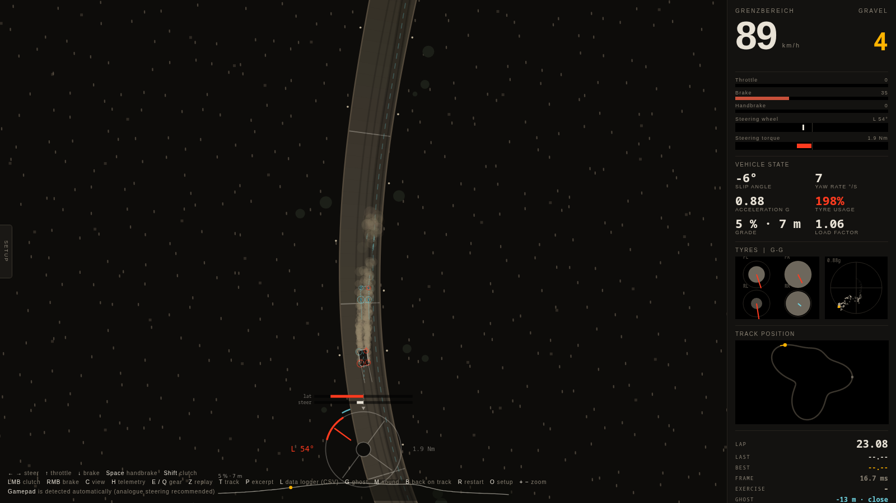
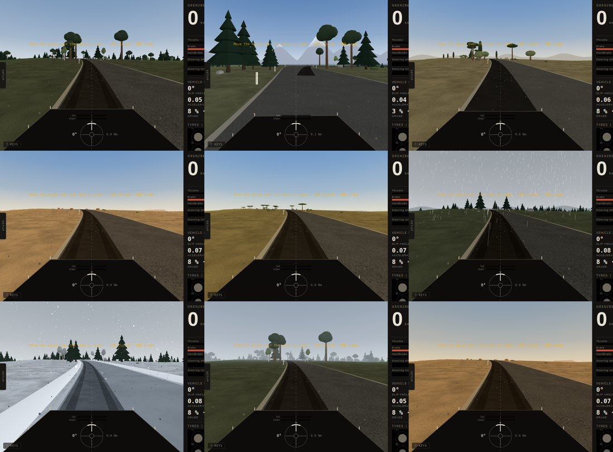
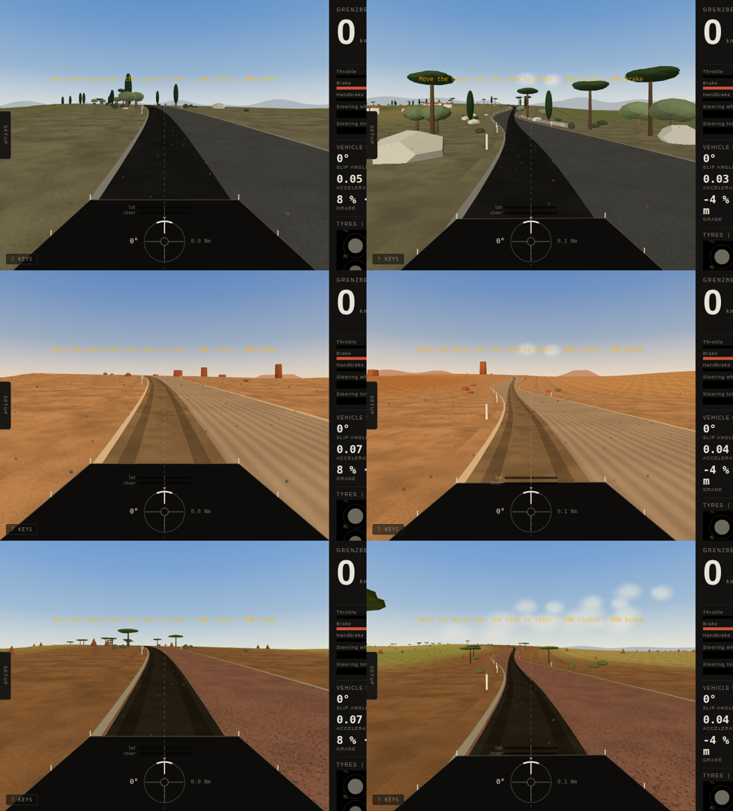
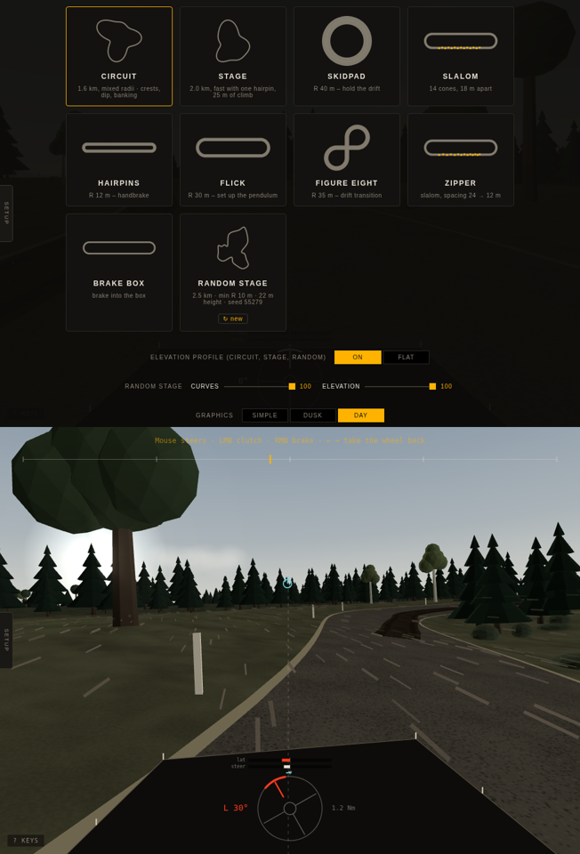
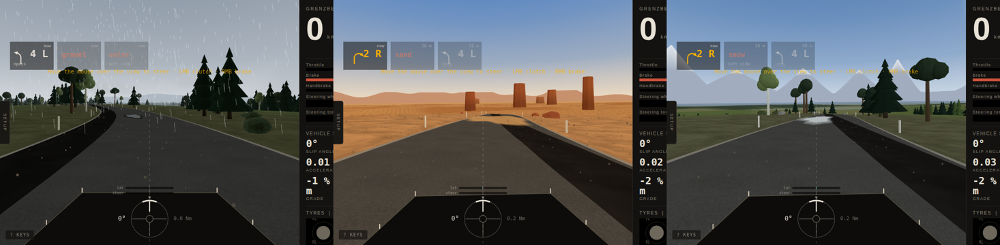
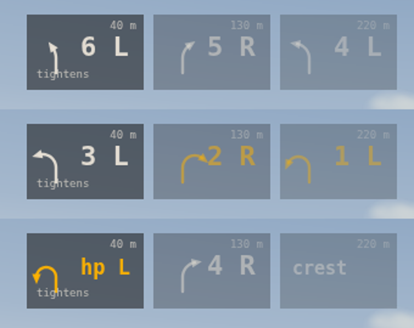

# Grenzbereich — Rally Vehicle Dynamics

A browser-based rally driving simulator built as a **training tool for the grip limit**, not as a racing game. *Grenzbereich* is German for the region at the limit of grip, which is what the simulator is built around. One HTML file, no build step, nothing loaded from elsewhere – the one library it uses, three.js r128 (MIT) for the 3D landscape, is included in the file; without WebGL the built-in 2D renderer draws the driver view: a Rally2-class car (1230 kg, 1.6-litre restricted turbo, five-speed sequential, rigid centre coupling) on tarmac, gravel, sand and snow, driven with mouse, keyboard, gamepad, tilt or a steering wheel.

Every mechanism in the physics is written down in the code and measured against standard manoeuvres. A phantom car drives the same physics on the ideal line, a data logger names the cause of every spin, and a headless test harness runs 100+ scenarios against plausibility rules.

**[Drive it here](https://gitcrush.github.io/grenzbereich/)** — desktop browser recommended; move the mouse over the view to steer.

The simulator is the single file [`index.html`](index.html) in this repository, served by GitHub Pages at [gitcrush.github.io/grenzbereich/index.html](https://gitcrush.github.io/grenzbereich/index.html). Nothing to install: open that address, or download the file and open it locally.



| Low sun on gravel and snow (3D) | 2D renderer, used without WebGL: banked tarmac near the limit |
|---|---|
|  |  |





| Mediterranean, desert and savanna | Random stage: the track menu with its curves and elevation dials |
|---|---|
|  |  |
| **Road hazards announced by the pace notes: gravel in the rain, sand, snow** | **Pace notes on the rally scale** |
|  |  |

## What it is for

The interesting part of driving a rally car happens in the last ten percent of grip: where the front axle starts to push, where the rear steps out, where lifting the throttle rotates the car and where a locked wheel stops steering. Grenzbereich is built around making that region legible:

- **Tyre usage per axle** in the HUD, load-weighted, colour-coded from the torque peak to the grip limit.
- **A phantom** that drives the same car on the ideal line with a consistent driver model, so you can see where it brakes and how much it slides.
- **Pace notes** (`N`): the next corners graded on the rally scale (6 fast … 1, hairpin) with tightens, opens, long, over crest and into, crests, dips and road hazards, the distance counting down – worked out from the road, also for random stages.
- **A tutor** (`U`): one recommendation for the steering wheel, on the band at the top of the screen, that keeps the car stable *and* on the road – on the line you are driving, not the ideal line. It continues your offset and the way you are moving across the road, aims a look-ahead down the road, and gives the wheel angle for that: in grip from the car's own steady-state behaviour (learned while you drive), in a slide from the front axle's direction of travel against the yaw the car cannot sustain. Quiet while the car is settled; shows bends ahead, the road edge, and slides (counter-steer, unwind). It never touches the input.
- **A data logger** (14-second ring buffer) with an incident detector that freezes the window around a breakaway and names the probable cause — lift-off, locked wheels, power-on, entry speed.
- **Exercises**: skidpad, slalom, chicane, hairpins, sweeper, figure eight, braking box.
- **Instrumented views**: a top view whose zoom covers your braking distance, and a driver view with a horizon-locked camera – the horizon holds, the bonnet tilts with the car, so climbs, crests and bankings read as such – built as a flow field (near-field texture, guide posts, road edge, vehicle axis vs. velocity vanishing point — the horizontal distance between the two *is* the slip angle), set in a scenery per surface – natural daylight by default (muted palette, strong aerial perspective, high cloud), dusk as an option. The landscape is a 3D scene in WebGL (three.js): a terrain mesh from a height field, the road as a ribbon mesh on it, instanced low-poly trees and posts, sky dome, distant mountains and distance fog, with a depth buffer – stable from every angle. Without WebGL the 2D renderer is used. Elements: distant ridges at infinity that move only with yaw, aerial haze over road and ground, meadows and fields beside the road. Each surface has its own country – tarmac a southern mountain road (snow-capped jagged ranges, cypresses, broad-leaved trees, rock outcrops, clear air), gravel a northern forest (rolling hills, pine and birch, boulders, dusty haze), snow a winter forest (low rounded hills, dense spruce with snow on the branches, snowbanks lining the road). Three graphics modes (`I`): day, dusk, and simple – the bare channel view the driver view started as.

## Physics model

The model is a textbook multi-body vehicle model rather than a soft-body or a game-tuned handling model. It runs at 360 Hz with a semi-implicit Euler integrator.

**Tyre** — normalised combined-slip characteristic with separately parameterised rise and drop (peak at unit normalised slip, residual friction `tail`, drop width `fall`), load sensitivity (−6.5 % per kN), degressive cornering stiffness (∝ Fz^0.65), sliding-velocity dependence, camber as slip-angle offset and as peak-grip modifier, separate longitudinal (0.15 m) and lateral (0.45 m) relaxation lengths, and a blend of the force direction towards the true sliding direction beyond the peak. On loose surfaces a **plough/wedge term** (Bekker-style bulldozing plus a saturating ρ·A·v² dynamic share) provides the lateral support and the yaw damping that make gravel driveable sideways.

**Vertical dynamics** — sprung body (heave, pitch, roll) over four unsprung masses with tyre springs; fixed wheel rates per axle (1.7 / 2.1 Hz), anti-roll bars derived from a roll-gradient setting and a distribution slider, damper curves with knee and bump/rebound asymmetry, progressive bump stops and hard droop stops per wheel, roll centres and anti-dive/squat as geometric load transfer.

**Kinematics** — Ackermann share, steering compliance with pneumatic and mechanical trail (the hand torque drives the steering-wheel display and force feedback), camber gain, static toe and bump steer (roll steer follows from it).

**Drivetrain** — engine as its own inertial state with a torque map and restrictor plateau, turbo spool as a first-order state (with anti-lag), stick-slip clutch with a driver model for launch and stall protection, five-speed sequential with ignition-cut upshifts and throttle-blip downshifts, plated axle differentials as Coulomb constraints with separate drive and coast locking values in the conventional sense (the torque difference the diff can hold as a share of the input torque), and a **rigid centre coupling** (Rally2 has no centre differential) implemented the same way. The handbrake disconnects the rear axle from the drive, as the real car's hydraulic clutch does.

**Road** — a road-fixed reference frame carries grade, cross slope and vertical curvature: crests unload the car, dips load it, banking presses it into the road. Four surfaces – tarmac, gravel, sand, snow – with their own grip, looseness and rolling resistance, and road hazards on top of them: puddles with partial and full hydroplaning and water drag, snow patches and ice, sand drifts and gravel spills, each acting on the wheel that is in it. Seven landscapes (Nordic forest, Alpine, Mediterranean coast with villages and olive groves, Desert with dunes and buttes, Savanna with acacias, termite mounds and a volcano, Highlands, Winter) and six weathers (clear, overcast, fog, rain – wet tarmac loses a quarter of its grip, gravel hardly any –, snowfall, dust) can be combined freely in the track menu. Random stages come from a seeded generator (track menu, or `#seed=…&c=…&e=…` in the address) with two dials, curves and elevation: from flowing and flat to tight hairpins, chicanes, 15 % grades and crests that unload the car – checked to be driveable. The circuit has an elevation profile – 20 m of height, a blind crest, a compression, a banked corner and an off-camber one – and so does the stage (21 m, grades to 8 %); and the land beside the road is a sidehill, so the profile is legible against the surroundings. The **road state** model makes the surface non-uniform across its width: a swept band around the driven line, loose material outside it, a berm at the edge, and ruts whose walls act on the wheels through the local cross slope.

**Driver models for the input device** — a keyboard key is on or off, a foot is not. The keyboard brake holds the pedal at the lock point (threshold braking, ~5 Hz), the keyboard throttle backs off when the driven wheels spin beyond the tyre's peak slip and comes back as they hook up (launches excepted), the clutch is operated by a launch-rpm model, and the keyboard steering commands the front slip angle rather than the wheel angle, so counter-steer follows by itself. Each of these can be switched to raw in the setup. Analogue inputs (pad, wheel) stay raw. Mouse steering follows the pointer position: the horizontal offset from the centre of the view is the steering-wheel angle, linear, no self-centring, the travel fitted to the window so that full lock is reached at its edges; once the mouse has taken the wheel it keeps it wherever the hand goes, until a steering key or a moving gamepad stick takes it back. Throttle stays on the keyboard, the mouse buttons are clutch and brake.

## Measured behaviour

From the test harness, all-wheel drive, default setup (tarmac / gravel / snow):

| Manoeuvre | Value | Rally2 reference |
|---|---|---|
| 0–100 km/h | 3.8 / 5.1 / 7.4 s | 4.3–5 s tarmac, ≈5 s gravel |
| 100–0 km/h, no ABS | 36.6 / 62.3 / 97.9 m | 32–36 m tarmac, 50–60 m gravel |
| Steady-state lateral limit | 1.25 / 0.87 / 0.53 g | 1.3–1.4 g tarmac, 0.7–0.9 g gravel |
| Understeer gradient | 1.5 / 3.0 / 5.0 °/g | ≈1–2 °/g tarmac |
| Roll gradient | 3.2 °/g | 3–5 °/g gravel setup |
| Yaw response t90 at 80 km/h, 0.4 g | 0.11 / 0.19 s | 0.10–0.20 s |
| Top speed | 199 km/h at the limiter in fifth | 190–200 km/h |

Every merged change must keep `test/consistency.js` clean: 117 scenarios across three drive types and three surfaces, checking ordering, left/right symmetry, physical invariants (ΣFz = m·g, ay = v·r, forces inside the friction circle, deceleration ≤ µ·g, acceleration ≤ P/(m·v)), recovery from slides, handbrake behaviour, determinism and state separation between player and phantom.

## Controls

| | Keyboard | Mouse (over the view) | Gamepad |
|---|---|---|---|
| Steer | ← → / A D | pointer position | left stick |
| Throttle / brake | ↑ ↓ / W S | keyboard / RMB | RT / LT |
| Clutch | Shift | LMB | LB |
| Handbrake | Space | | A |
| Gears | E / Q | | bumpers |

`R` reset · `B` back on track · `T` track menu · `O` setup · `U` tutor · `N` pace notes · `I` graphics · `J` render debug · `F1` key list · `V` top/driver view · `G` phantom · `Z` replay · `L` export CSV · `P` short excerpt · `H` hide HUD · `M` sound · `C` cycle views (driver, top, top north-up) · `+ −` zoom.

On phones and tablets (landscape): swipe up on the left half for throttle and down for brake – the travel from where the thumb landed sets the pedal, and full pedal is always within reach – and steer with the thumb on the horizontal slider at the bottom right, absolute like the mouse; it stays where you leave it (or returns to centre, see setup). A thumb-crank wheel is available as an alternative. Handbrake bottom left, gears and view top right. Tilt steering remains available as an option. Logitech wheels get constant-force feedback through WebHID in Chromium browsers.

## Setup

The surface decides the setup: choosing Gravel, Tarmac or Snow loads that surface's template (and the rear-wheel-drive values on top if RWD is selected). Four templates load complete, measured setups: **Gravel** (the base: soft, rear-biased roll stiffness, 76 % front brake bias, diff locks 40/25 %), **Tarmac** (stiffer and lower, 52 % front roll stiffness so the inside rear stays on the ground at the limit, 82 % front brake, locks 40/25 %) **Snow** (soft and gentle: 72 % front brake, locks 45/30 %, softer damping) and **RWD drift** (rear-wheel drive with a strong rear diff, 75/50 %, and a stable rear axle). Selecting a drivetrain loads its rear-axle values on top (rear-wheel drive: a plated 1.5-way diff at 68/45 %, 52 % front roll stiffness, 0.32° rear toe-in, 0.17 rear roll steer, 78 % front brake bias – halfway between a neutral race setup and a forgiving one).

The setup panel (`O`) exposes the quantities a rally team would adjust: surface, drive type, centre lock and split, axle lock on drive and coast, brake bias, roll distribution and roll gradient, static camber, toe, rear roll steer, damping, CoG height, ABS and traction control as training aids, anti-lag, keyboard pedal travel and threshold braking, steering mode, road state, elevation profile, and the visual channels of the driver view.

## Known limitations

- The tyre is a normalised model without temperature, pressure or wear, and its parameters are engineering estimates, not measured data.
- One car, one circuit with elevation, a stage loop and seven practice layouts. No damage, no collisions with the surroundings.
- The phantom's driver model is tuned for all-wheel drive; as a front- or rear-wheel-drive car it is slower and occasionally runs wide on gravel.
- The road state is static: the swept band and the ruts follow the ideal line and do not yet evolve with your own passes.
- The sound is synthesised in the browser and has not been compared with recordings.

## Test harness

The physics runs headless in Node against DOM stubs. See [`test/README.md`](test/README.md).

```
cd test
python3 extract.py          # pulls the script block out of ../index.html
node consistency.js         # the scenario matrix, 2–3 minutes
node bench.js               # the reference figures
```

With `@napi-rs/canvas` and `node-web-audio-api` installed, `shot.js` renders the driver view without a browser and `soundtest.js` renders sound demos as WAV — useful for reviewing changes. The 2D driver views are such renders; the 3D views come from a headless Chromium (`test/browser/`), and the top view from `uishot.js`, which drives the page in a headless Chromium through Playwright, with the phantom's driver model at the wheel and the full interface around it.

## Contributing

Physics changes are welcome when they come with a scenario in the harness and a rationale in the code. The comment style is deliberate: every mechanism states what it models, why it is there and what breaks without it. The single-file structure is kept for distribution; a module split with a build step is the first structural change planned.

Open work is listed in [TODO.md](TODO.md). Good first topics: dynamic road state (each pass sweeps the line and deepens the ruts — DiRT Rally 2.0's 150-step degradation is a useful calibration reference), a phantom driver model for two-wheel drive, a tarmac setup preset, tyre temperature.

## Licence

Apache License 2.0 — see [LICENSE](LICENSE). The design decisions and their justification are documented in the code.
